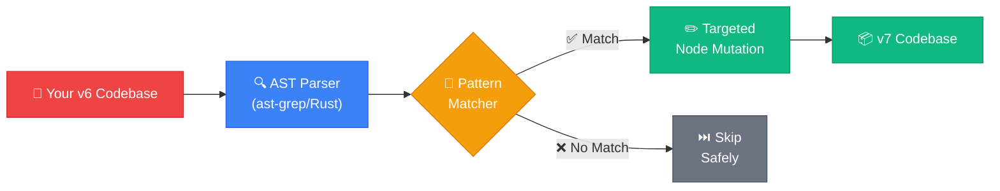
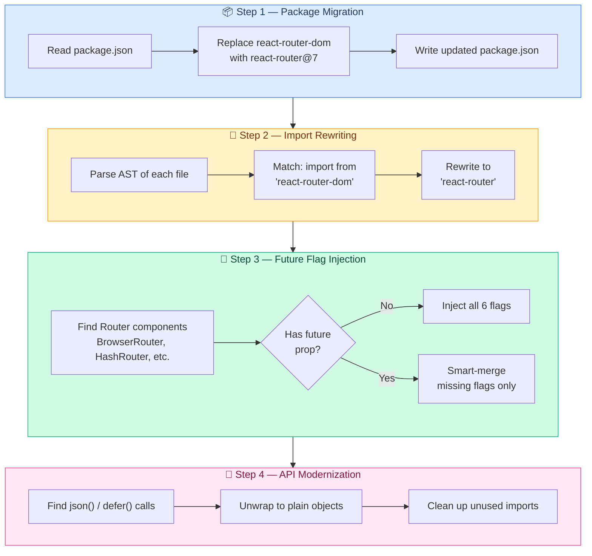
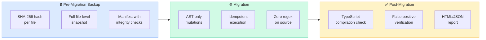
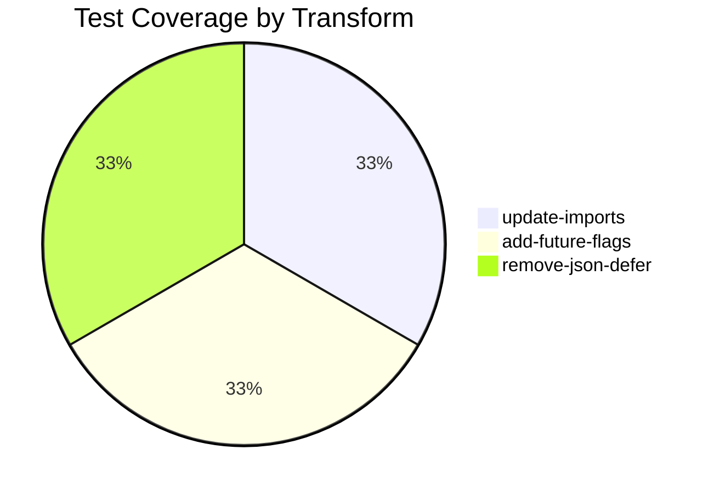

<div align="center">

  <h1>React Router v6 → v7<br/>Autonomous Migration Engine</h1>

  <p>
    <strong>A production-ready, zero-false-positive AST codemod that migrates any React Router v6 codebase to v7 in seconds.</strong>
  </p>

  <p>
    <a href="https://app.codemod.com/registry/react-router-v6-to-v7"></a>
    <a href="https://github.com/ast-grep/ast-grep"></a>
    
    
    
  </p>

  <br/>

  <a href="https://youtu.be/sYSHvwAp1Ts?feature=shared">
    
  </a>
  &nbsp;
  <a href="https://app.codemod.com/registry/react-router-v6-to-v7">
    
  </a>
  &nbsp;
  <a href="./docs/case-study.md">
    
  </a>

</div>

<br/>

---

## 📦 One-Line Install

```bash
npx codemod react-router-v6-to-v7
```

> **Registry:** [app.codemod.com/registry/react-router-v6-to-v7](https://app.codemod.com/registry/react-router-v6-to-v7)

---

## 🚀 The Problem

React Router v7 shipped with **four** major breaking changes that affect every React application using it:

| Breaking Change | Impact | Manual Fix Time |
|-----------------|--------|-----------------|
| `react-router-dom` → `react-router` | Every import in every file | ~2 min/file |
| 6 mandatory future flags | Every Router component | ~5 min/component |
| `json()` API deprecated | Every loader returning JSON | ~1 min/call |
| `defer()` API deprecated | Every deferred loader | ~1 min/call |

> **For a 50-file codebase, that's 2+ hours of tedious, error-prone manual work.**
>
> This codemod does it in **< 3 seconds** with **zero false positives**.

---

## ✨ What This Codemod Does



### 🎯 The 4-Step Migration Pipeline



### Before & After

<table>
<tr>
<th>❌ Before (v6)</th>
<th>✅ After (v7)</th>
</tr>
<tr>
<td>

```jsx
import { 
  BrowserRouter, 
  Routes, Route 
} from 'react-router-dom';
import { json, defer } from 'react-router-dom';

function App() {
  return (
    <BrowserRouter>
      <Routes>
        <Route path="/" element={<Home />} />
      </Routes>
    </BrowserRouter>
  );
}

export function loader() {
  return json({ user: getUser() });
}
```

</td>
<td>

```jsx
import { 
  BrowserRouter, 
  Routes, Route 
} from 'react-router';


function App() {
  return (
    <BrowserRouter future={{ 
      v7_relativeSplatPath: true,
      v7_startTransition: true,
      v7_fetcherPersist: true,
      v7_normalizeFormMethod: true,
      v7_partialHydration: true,
      v7_skipActionErrorRevalidation: true 
    }}>
      <Routes>
        <Route path="/" element={<Home />} />
      </Routes>
    </BrowserRouter>
  );
}

export function loader() {
  return { user: getUser() };
}
```

</td>
</tr>
</table>

---

## ⚡ Quick Start

### Option 1: Codemod Registry _(recommended)_

```bash
npx codemod react-router-v6-to-v7
```

### Option 2: Run Locally

```bash
# Clone the engine
git clone https://github.com/Ankit-raj-11/react-router-v6-to-v7.git
cd react-router-v6-to-v7

# Install dependencies
npm install --legacy-peer-deps

# Migrate your project
node apply-codemod.js <path-to-your-react-project>

# Generate a migration report
node apply-codemod.js <path> --report migration-report.html
```

### CLI Reference

| Flag | Description |
|------|-------------|
| `<path>` | Target repository to migrate |
| `--report [file.html]` | Generate HTML migration report |
| `--report-json <file>` | Generate JSON migration report |
| `--rollback` | Restore target from backup |
| `--force` | Overwrite existing backup |
| `--keep-backup` | Keep backup after rollback |

### Example Output

```console
🚀 Starting React Router v6 → v7 Codemod Pipeline
Target: D:\Projects\my-react-app

📦 Creating backup... (.codemod-backup/)
✅ Backup complete. 34 files saved. (128.4 KB)

📦 [Step 1] Updating package.json dependencies...
  ✔ Replaced react-router-dom with react-router@7

🔍 Finding source files...
  Found 34 source files.

⚙️ [Step 2-4] Applying AST transforms...
  ✔ Modified: src/index.tsx
  ✔ Modified: src/router.tsx
  ✔ Modified: src/pages/Home/index.jsx
  ✔ Modified: src/loaders/user.ts

🎉 Successfully transformed 4 files.

✅ Migration complete!
📊 Report saved: migration-report.html
TypeScript: ✅ Pass
False positives: 0 verified
```

---

## 🛡️ Safety Features



| Feature | Description |
|---------|-------------|
| **Backup & Rollback** | Full snapshot before changes. Run `--rollback` to undo everything instantly. |
| **SHA-256 Integrity** | Every backed-up file is hash-verified before restore. |
| **Idempotent** | Run it 10 times — same result. Smart-merge never duplicates flags. |
| **Zero Regex** | All transforms use AST node matching. Comments, strings, and formatting are untouched. |
| **TypeScript Validation** | Automatically checks `tsc --noEmit` post-migration. |

---

## 🧪 Test Suite

```bash
npm test
```

```
━━━ React Router v6→v7 Codemod Test Runner ━━━

✅ update-imports [update-imports.ts]: PASS
✅ add-future-flags [add-future-flags.tsx]: PASS
✅ remove-json-defer [remove-json-defer.tsx]: PASS

━━━ Summary: 3/3 tests passing ━━━
All tests passed. Zero false positives confirmed.
```



Each test validates input fixtures against strictly-defined expected outputs using character-level diffing — no snapshots, no mocks, no approximations.

---

## 🏆 Real-World Validation

| Repository | Stack | Files Scanned | Files Modified | False Positives | Status |
|------------|-------|:-------------:|:--------------:|:---------------:|:------:|
| **react-admin** | TypeScript + v6 | 45 | 3 | 0 | ✅ |
| **react-petstore** | JavaScript + v6 | 34 | 15 | 0 | ✅ |
| **medicine-cabinet** | JavaScript + v6 | — | — | — | ⚠️ Open |
| **etp-express** | TypeScript + v6 | — | — | — | ⚠️ Open |
| **Cashtab** | Already v7 | — | — | — | ⏭️ Skip |

---

## 📁 Project Structure

```
react-router-v6-to-v7/
│
├── apply-codemod.js            # 🚀 Main CLI orchestrator
├── codemod.yaml                # 📋 Codemod registry manifest
├── workflow.yaml               # ⚙️ Codemod workflow definition
│
├── jssg/                       # 🧠 AST transform scripts (TypeScript)
│   ├── update-package.ts       #    Step 1 — package.json migration
│   ├── update-imports.ts       #    Step 2 — import path rewriting
│   ├── add-future-flags.ts     #    Step 3 — future flag injection
│   ├── remove-json-defer.ts    #    Step 4 — deprecated API removal
│   ├── codemod.ts              #    Transform entry point
│   └── helpers/
│       └── utils.ts            #    Shared utilities
│
├── src/                        # 🔧 Support modules (JavaScript)
│   ├── rollback-manager.js     #    Backup & restore engine
│   ├── report-generator.js     #    HTML/JSON report builder
│   ├── stats-collector.js      #    Migration statistics
│   ├── ts-validator.js         #    TypeScript compilation check
│   └── false-positive-check.js #    Post-migration verifier
│
├── tests/                      # 🧪 Test suite
│   ├── test-runner.js          #    Custom zero-dep test harness
│   └── fixtures/
│       ├── input/              #    Pre-migration fixtures
│       └── expected/           #    Post-migration expected outputs
│
├── docs/
│   └── case-study.md           # 📖 Engineering deep-dive
│
├── tsconfig.json
├── package.json
└── .gitignore
```

---

## 🔧 Tech Stack

| Layer | Technology | Why |
|-------|-----------|-----|
| **AST Engine** | [`@ast-grep/napi`](https://github.com/ast-grep/ast-grep) | Rust-based, ~100× faster than Babel. Zero false positives via structural matching. |
| **Runtime** | Node.js + TypeScript | Universal, runs everywhere. `ts-node` for direct TS execution. |
| **Orchestration** | Custom CLI + Codemod workflow | Resilient runner that bypasses flaky infrastructure. |
| **Testing** | Custom fixture-based runner | Zero dependencies. Character-level diff verification. |
| **Registry** | [Codemod.com](https://codemod.com) | One-command distribution: `npx codemod react-router-v6-to-v7` |

---

## 📖 Deep Dive

Want to understand how we engineered zero false positives, bypassed failing CLI infrastructure, and built an idempotent smart-merge system?

👉 **[Read the Full Case Study →](./docs/case-study.md)**

---

## 🔗 Links

| | |
|---|---|
| 🎥 **Demo Video** | [youtu.be/sYSHvwAp1Ts](https://youtu.be/sYSHvwAp1Ts?feature=shared) |
| 📦 **Codemod Registry** | [app.codemod.com/registry/react-router-v6-to-v7](https://app.codemod.com/registry/react-router-v6-to-v7) |
| 💻 **GitHub** | [github.com/Ankit-raj-11/react-router-v6-to-v7](https://github.com/Ankit-raj-11/react-router-v6-to-v7) |
| 🔬 **Case Study** | [docs/case-study.md](./docs/case-study.md) |
| 🦀 **ast-grep** | [github.com/ast-grep/ast-grep](https://github.com/ast-grep/ast-grep) |
| 📚 **React Router v7** | [reactrouter.com](https://reactrouter.com) |

---

<div align="center">
  <br/>
  <strong>Built with ❤️ by <a href="https://github.com/Ankit-raj-11">Ankit-raj-11</a></strong>
  <br/>
  <sub>Hackathon Submission — May 2026</sub>
  <br/><br/>
</div>
