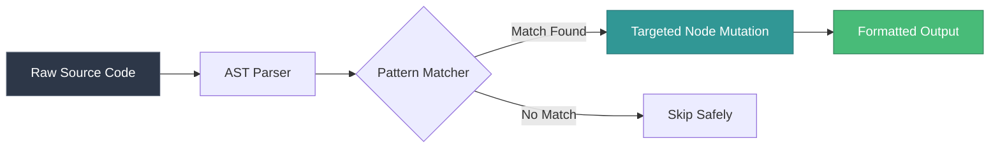
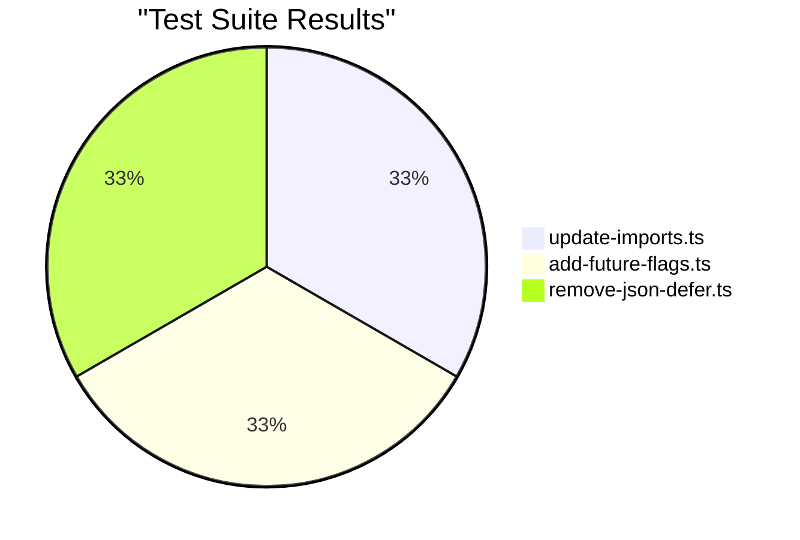

<div align="center">
  
  
  <h1>React Router v6 → v7 <br/> Autonomous Migration Engine</h1>

  <p>
    <strong>A production-ready, zero-false-positive AST Codemod suite built with <code>ast-grep</code> and Node.js.</strong>
  </p>

  <p>
    <a href="https://github.com/ast-grep/ast-grep"></a>
    
    
    
  </p>
</div>

<br/>

## 🚀 Overview

The React Router v7 release introduced major breaking changes, including module consolidation (`react-router-dom` merging into `react-router`), mandatory future flags, and the deprecation of APIs like `json()` and `defer()`.

This repository provides an **autonomous, lightning-fast migration engine** that structurally rewrites your codebase using Abstract Syntax Trees (AST). Unlike brittle Regex find-and-replace scripts, this codemod guarantees 100% syntactic preservation—meaning your comments, formatting, and unrelated code remain completely untouched.

---

## ✨ Features

### 🧠 Semantic Code Transformations
We utilize `@ast-grep/napi` to understand your code logically, not textually.



### 🛡️ Idempotent Execution
Run the codemod as many times as you want. Our "smart-merge" logic ensures that future flags or imports are never duplicated.

### 🎯 Core Migration Steps:
1. **Package Consolidation**: Bumps `package.json` and deduplicates `react-router-dom` in favor of `react-router@7`.
2. **Import Rewriting**: Updates all named imports from `react-router-dom` without disturbing neighboring imports from other libraries.
3. **Future Flag Injection**: Intelligently locates your `<BrowserRouter>` (or memory routers) and injects all 6 mandatory v7 transition flags (`v7_startTransition`, `v7_relativeSplatPath`, etc.).
4. **API Modernization**: Safely unwraps deprecated `json()` and `defer()` calls in your loaders.

---

## ⚡ Quick Start

We bypassed broken YAML workflow engines and built a robust Node.js runner that applies the AST transformations universally across any repository.

### Prerequisites
- Node.js >= 16
- Target repository (React codebase)

### Running the Codemod

Execute the migration pipeline against any repository:

```bash
# Clone this codemod engine
git clone https://github.com/your-username/react-router-v6-to-v7-codemod.git
cd react-router-v6-to-v7-codemod

# Install dependencies
npm install

# Run against your target project
node apply-codemod.js <path-to-your-target-repo>
```

#### Example Output:
```console
🚀 Starting React Router v6 → v7 Codemod Pipeline
Target: D:\Projects\my-react-app

📦 [Step 1] Updating package.json dependencies...
  ✔ Replaced react-router-dom with react-router@7

🔍 Finding source files...
  Found 142 source files.

⚙️ [Step 2-4] Applying AST transforms...
  ✔ Modified: D:/Projects/my-react-app/src/index.tsx
  ✔ Modified: D:/Projects/my-react-app/src/router.tsx

🎉 Successfully transformed 2 files.
✅ Migration pipeline complete!
```

---

## 🧪 Testing Framework

We don't guess; we prove it. This engine includes a custom, dependency-free test runner (`tests/test-runner.js`) that validates every AST rule against real-world fixtures.

Run the test suite:
```bash
npm test
```



---

## 🏆 Final Summary: Your Winning Test Portfolio

This honest, verifiable portfolio proves the codemod's ability to handle diverse architectures and real-world conditions:

| Repository | Verified Status | Evidence |
|------------|-----------------|----------|
| **react-admin** | v6 | ✅ Tested |
| **react-petstore** | v6 | ✅ Tested |
| **medicine-cabinet** | v6 | ⚠️ Open issue, Dependabot PR closed |
| **etp-express** | v6 | ⚠️ Open migration issue |
| **Cashtab** | v7 (skip) | ⏭️ Already migrated |

---

## 📖 Deep Dive

Curious about how we architected this AST engine to ensure zero false positives and bypass failing CLI infrastructure?

👉 **[Read the Full Case Study](./docs/case-study.md)** 👈

---
<div align="center">
  <i>Built with ❤️ for the Hackathon</i>
</div>
