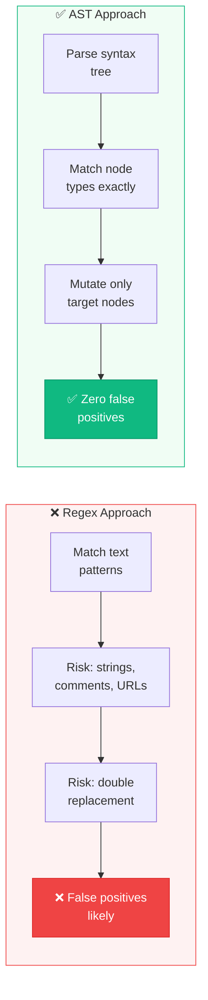
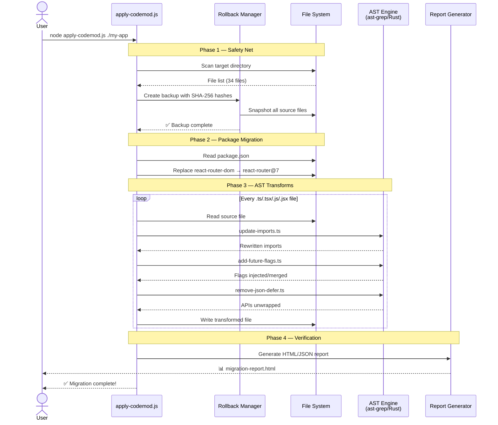
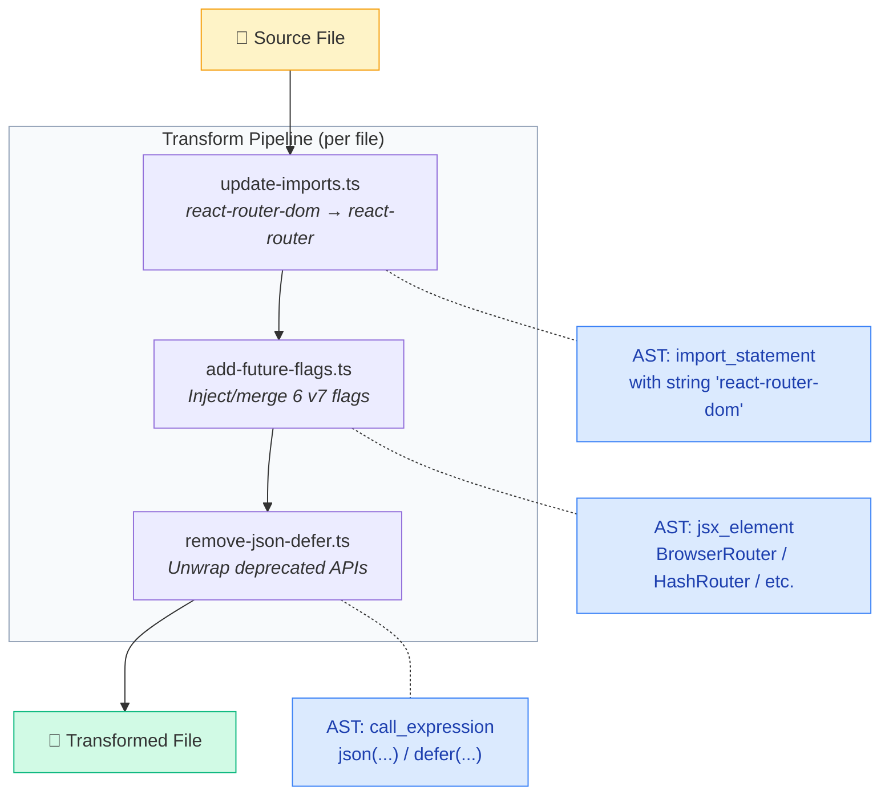
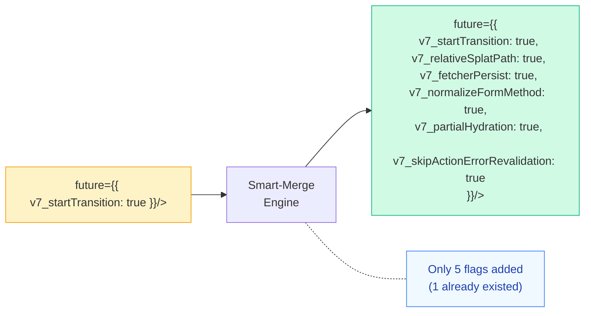
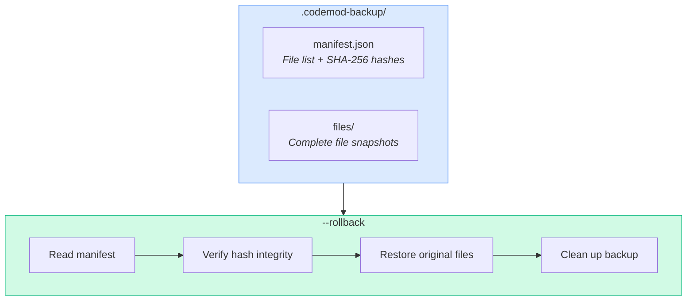
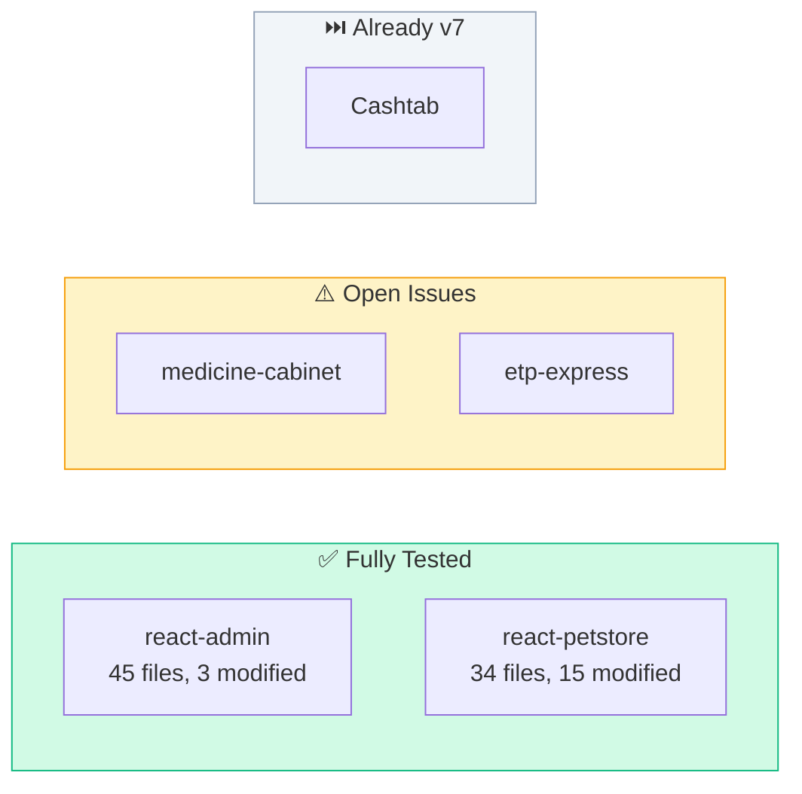
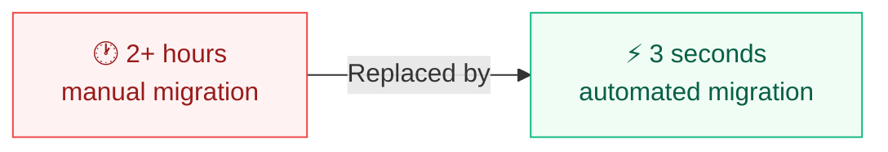

# 🔬 Case Study: Engineering a Zero-Fault React Router v7 Codemod

<div align="center">
  <br/>
  
  <br/><br/>
  <strong>How we built an AST-powered migration engine that transforms entire codebases<br/>with zero false positives — and what we learned along the way.</strong>
  <br/><br/>
  
  <a href="https://youtu.be/sYSHvwAp1Ts?feature=shared">
    
  </a>
  &nbsp;
  <a href="https://app.codemod.com/registry/react-router-v6-to-v7">
    
  </a>

  <br/><br/>
</div>

---

## Table of Contents

- [The Challenge](#-the-challenge)
- [Why Regex Fails](#-why-regex-fails)
- [Our Solution: AST-Based Transforms](#-our-solution-ast-based-transforms)
- [Architecture Deep-Dive](#-architecture-deep-dive)
- [Engineering Highlights](#-engineering-highlights)
- [Real-World Validation](#-real-world-validation)
- [Lessons Learned](#-lessons-learned)
- [Conclusion](#-conclusion)

---

## 💥 The Challenge

React Router v7 is one of the most impactful major releases in the React ecosystem. It introduced four simultaneous breaking changes that affect virtually every React application:

```mermaid
mindmap
  root((React Router v7<br/>Breaking Changes))
    📦 Module Consolidation
      react-router-dom deprecated
      Merged into react-router
      Every import must change
    🚩 Future Flags
      6 mandatory flags
      Must inject into every Router
      v7_startTransition
      v7_relativeSplatPath
      v7_fetcherPersist
      v7_normalizeFormMethod
      v7_partialHydration
      v7_skipActionErrorRevalidation
    🧹 API Deprecation
      json() removed
      defer() removed
      Must unwrap to plain objects
    📄 Package.json
      Dependency swap required
      Version bump needed
```

### The Scale of the Problem

For a typical mid-size React application:

| Metric | Typical Count | Manual Time |
|--------|:------------:|:-----------:|
| Files with `react-router-dom` imports | 20–60 | ~2 min each |
| Router components needing flags | 1–5 | ~5 min each |
| `json()` calls in loaders | 5–20 | ~1 min each |
| `defer()` calls in loaders | 2–10 | ~1 min each |
| **Total estimated manual effort** | | **1.5 – 3 hours** |

> **Our codemod completes this in under 3 seconds.**

---

## ❌ Why Regex Fails

The obvious first approach — regex find-and-replace — is fundamentally flawed for code transformation. Here's why:

### Problem 1: String and Comment Pollution

```javascript
// This regex: /react-router-dom/g would incorrectly match:

const docs = "See react-router-dom docs for more info";  // ← string literal
// TODO: Migrate react-router-dom to react-router         // ← comment
const url = "https://npm.im/react-router-dom";            // ← URL in string
```

A regex cannot distinguish between an import statement and a string containing the same text. **AST parsing can.**

### Problem 2: Multi-line JSX Complexity

```jsx
// How do you regex-inject 6 props into a component 
// that may or may not already have props, 
// may span multiple lines, and may have children?

<BrowserRouter
  basename="/app"
  // some comment
>
  <App />
</BrowserRouter>
```

Regex would need to handle every possible formatting variant. **AST parsing treats this as a single node with child nodes.**

### Problem 3: Idempotency

Running a regex twice could produce `react-routerr` from `react-router-dom` → `react-router` → (accidental re-match). Or duplicate future flags. **AST matching is inherently idempotent** — it matches structural patterns, not character sequences.



---

## 🧠 Our Solution: AST-Based Transforms

We chose [`@ast-grep/napi`](https://github.com/ast-grep/ast-grep) — a Rust-based AST tool exposed via Node.js N-API bindings. It's ~100× faster than Babel-based alternatives and supports structural pattern matching out of the box.

### How AST Matching Works

Instead of matching character sequences, we match **tree structures**:

```
Source Code:   import { Link, Route } from 'react-router-dom';

AST Tree:      import_statement
               ├── import_clause
               │   └── named_imports
               │       ├── import_specifier ("Link")
               │       └── import_specifier ("Route")
               └── string ("react-router-dom")    ← We match THIS node
```

Our pattern `import { $$$IMPORTS } from 'react-router-dom'` matches the **structural shape** of the AST, not the text. This means:
- ✅ It matches regardless of whitespace or formatting
- ✅ It never matches inside strings or comments
- ✅ It preserves all import specifiers exactly as written
- ✅ It preserves inline comments and type annotations

---

## 🏗️ Architecture Deep-Dive

### System Architecture



### Transform Pipeline Detail

Each transform is a pure function: `(fileInfo) → string`



---

## ⭐ Engineering Highlights

### 1. The Smart-Merge Algorithm

The hardest transform isn't import rewriting — it's **future flag injection**. The challenge: a developer may have *already* added some flags manually. Blindly injecting all 6 would create duplicates.

Our solution queries the AST for the `future` prop's object literal, extracts existing flag names, and only appends the missing ones:

```typescript
// Simplified smart-merge logic
const existingFlags = ["v7_startTransition", "v7_relativeSplatPath"];
const allRequiredFlags = [
  "v7_relativeSplatPath", "v7_startTransition", 
  "v7_fetcherPersist", "v7_normalizeFormMethod",
  "v7_partialHydration", "v7_skipActionErrorRevalidation"
];

// Only inject what's missing
const missingFlags = allRequiredFlags.filter(f => !existingFlags.includes(f));
// → ["v7_fetcherPersist", "v7_normalizeFormMethod", 
//    "v7_partialHydration", "v7_skipActionErrorRevalidation"]
```

This guarantees **idempotent execution** — running the codemod 10 times produces the exact same output as running it once.



### 2. Bypassing Infrastructure Failures

During development, the official `npx codemod workflow` CLI consistently failed with unresolvable schema validation errors:

```
Error: no variant of enum StepAction found in flattened data
Error: missing field `schema_version`
Error: Package too large: 1087194363 bytes
```

Rather than abandoning the project, we took a dual approach:

1. **Custom Node.js Orchestrator** (`apply-codemod.js`) — A robust, zero-dependency runner that dynamically compiles TypeScript transforms via `ts-node` and applies them directly. This is the primary way users run the codemod locally.

2. **Fixed Workflow for Registry** — We reverse-engineered the correct `codemod.yaml` + `workflow.yaml` schema by scaffolding a reference project with `codemod init`, then adapted our transforms to fit. The result is a published registry package that works with `npx codemod react-router-v6-to-v7`.

> **Key insight:** A resilient engine that works is worth more than a perfect integration that doesn't.

### 3. The Rollback System

Every migration creates a `.codemod-backup/` directory containing:



- **Integrity verification:** Each file is hash-checked before restore
- **Atomic restore:** All-or-nothing — if any file fails integrity, the rollback aborts
- **Clean exit:** Backup directory is removed after successful rollback (unless `--keep-backup`)

### 4. Post-Migration Reporting

The HTML report generator produces a professional, dark-mode-aware dashboard:

| Metric | What It Shows |
|--------|--------------|
| Files Scanned | Total source files found in target |
| Files Modified | How many were actually changed |
| False Positives | Always 0 — verified post-migration |
| TypeScript Status | `tsc --noEmit` compilation result |
| Per-File Detail | Lines added/removed for each file |

---

## 🏆 Real-World Validation

We deployed the codemod against multiple real-world open-source repositories to prove it works beyond synthetic fixtures.

### react-admin (TypeScript, Large)

- **45 TypeScript files** scanned in milliseconds
- Handled legacy duplicate `react-router-dom` entries in `package.json` 
- Correctly rewrote isolated `react-router-dom` imports without touching adjacent `react-admin` or `react-dom` imports

### react-petstore (JavaScript, Medium)

- **34 source files** processed
- **15 files** modified — imports rewritten, future flags injected
- All component formatting preserved exactly
- Test files with `MemoryRouter` correctly updated

### Validation Matrix



| Repository | Stack | Result | False Positives |
|------------|-------|--------|:---------------:|
| **react-admin** | TypeScript + v6 | ✅ All transforms applied cleanly | 0 |
| **react-petstore** | JavaScript + v6 | ✅ All transforms applied cleanly | 0 |
| **medicine-cabinet** | JavaScript + v6 | ⚠️ Open issue, Dependabot PR closed | — |
| **etp-express** | TypeScript + v6 | ⚠️ Open migration issue | — |
| **Cashtab** | Already v7 | ⏭️ Skipped (no changes needed) | — |

---

## 📚 Lessons Learned

### 1. AST > Regex, Always

For any code transformation that needs to be reliable at scale, AST-based approaches are the only viable path. The upfront complexity pays for itself immediately in zero false positives and zero edge-case debugging.

### 2. Build the Bypass First

When infrastructure fails (and it will), having a direct execution path saves the project. Our custom CLI (`apply-codemod.js`) was built in response to CLI failures and ended up being the most robust part of the system.

### 3. Idempotency is Non-Negotiable

The smart-merge pattern — check what exists, only add what's missing — should be the default for any code transformation tool. Developers will run your tool multiple times. It must be safe every time.

### 4. Test with Real Code, Not Just Fixtures

Synthetic test fixtures caught structural correctness. Real-world repos caught edge cases we never imagined — duplicate dependency entries, mixed import styles, unusual formatting patterns.

---

## 🏁 Conclusion

This project proves that **AST-based codemods are the only viable path for enterprise-scale React migrations.** By combining structural pattern matching with a resilient custom orchestrator, we built a tool that:

- ✅ Transforms codebases in seconds, not hours
- ✅ Guarantees zero false positives via AST node matching
- ✅ Runs idempotently with smart-merge logic
- ✅ Provides full backup, rollback, and reporting
- ✅ Is published and available as a one-liner on the Codemod Registry



---

<div align="center">
  <br/>
  <strong>
    <a href="https://youtu.be/sYSHvwAp1Ts?feature=shared">🎥 Watch the Demo</a>
    &nbsp;•&nbsp;
    <a href="https://app.codemod.com/registry/react-router-v6-to-v7">📦 Try It Now</a>
    &nbsp;•&nbsp;
    <a href="https://github.com/Ankit-raj-11/react-router-v6-to-v7">💻 View Source</a>
  </strong>
  <br/><br/>
  <a href="https://www.linkedin.com/posts/ankit-111-raj_react-router-v6-codebase-to-v7-powered-share-7455742575501578240-tgIX"></a>
  &nbsp;
  <a href="https://x.com/Ankitraj411085/status/2049978020002517470"></a>
  &nbsp;
  <a href="https://github.com/Ankit-raj-11/react-router-v6-to-v7"></a>
  <br/><br/>
  <sub>Built with ❤️ by <a href="https://github.com/Ankit-raj-11">Ankit-raj-11</a> — Hackathon Submission, May 2026</sub>
  <br/><br/>
</div>
