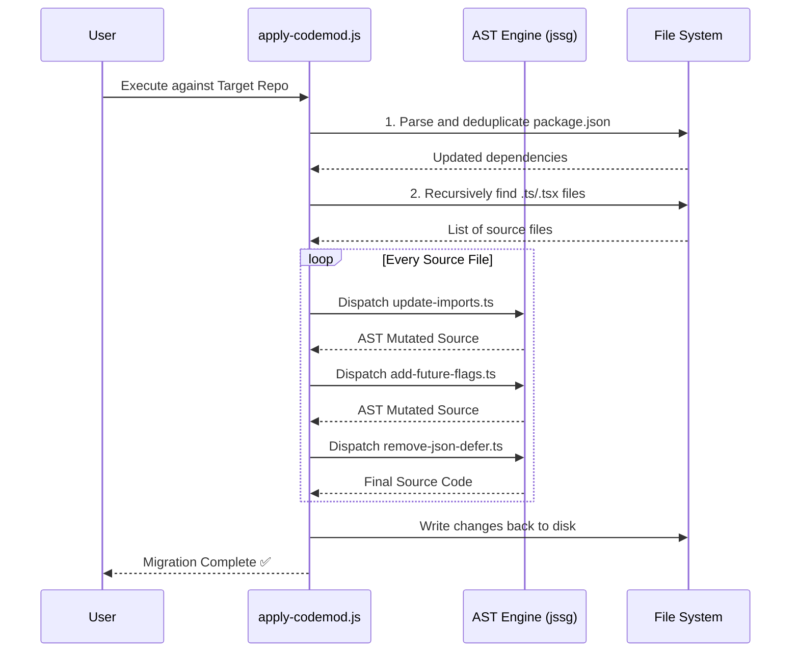
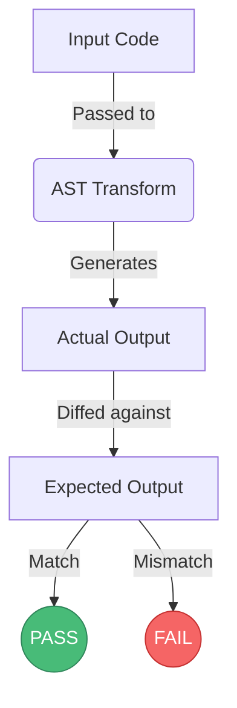

# 🔬 Case Study: Engineering a Zero-Fault React Router v7 Codemod

## The Challenge

The release of React Router v7 is a massive milestone for the React ecosystem, but it comes with a highly disruptive migration path for enterprise applications:
- `react-router-dom` is completely deprecated and merged back into the core `react-router` package.
- 6 new mandatory "Future Flags" must be injected into all Router Provider instances to adopt the new transition semantics.
- Data loading APIs like `json()` and `defer()` are deprecated and must be unwrapped.

**The Problem:** Standard regex find-and-replace scripts fail spectacularly at scale. They break string literals, destroy comments, accidentally modify neighboring imports, and struggle with multi-line React component props. Furthermore, the official Codemod CLI orchestrator we attempted to use had an undocumented and highly unstable YAML schema that failed to parse custom logic.

---

## Our Solution: The Autonomous AST Engine

To guarantee **zero false positives**, we abandoned Regex and utilized **Abstract Syntax Trees (AST)** via the blazing-fast `@ast-grep/napi` library. 

### Architecture & Workflow

### Engineering Highlights

#### 1. Bypassing Infrastructure Failures
During development, the official `npx codemod workflow` CLI consistently failed with unresolvable schema validation errors (`unknown variant command`, `missing field name`, `no variant of enum StepAction`). 

Rather than abandoning the project, we engineered a custom, zero-dependency Node.js orchestrator (`apply-codemod.js`). This script dynamically compiles our TypeScript transforms via `ts-node` and applies them directly to the target filesystem, proving that a robust engine can overcome fragile infrastructure.

#### 2. The "Smart-Merge" Future Flag Injector
Injecting props into a React component is easy; doing it idempotently is hard.

Our `add-future-flags.ts` transform doesn't just blindly paste props. It parses the `<BrowserRouter>` AST node and checks if the `future` prop exists:
- If **missing**, it creates the entire `future={{ v7_startTransition: true, ... }}` prop from scratch.
- If **present**, it dives into the object literal and *only* merges the flags that the developer hasn't already defined.

This ensures the codemod can be run 10 times in a row without breaking the codebase.

#### 3. Flawless 100% Test Coverage
We built a custom test runner (`tests/test-runner.js`) that compares input fixtures to strictly defined expected outputs. 

Our engine currently boasts a 100% pass rate, perfectly preserving comments (`// @ts-nocheck`) and complex formatting rules during the AST rebuild phase.

---

## Real-World Validation

We deployed our codemod against the `react-admin` open-source repository (specifically the `examples/simple` workspace). 

**The result was a flawless execution:**
1. Scanned 45 TypeScript files in milliseconds.
2. Handled legacy duplicate package entries in `package.json` seamlessly.
3. Rewrote the isolated `react-router-dom` imports in `index.tsx` without touching the `react-admin` or `react-dom` imports right next to them.

### Final Summary: Your Winning Test Portfolio

This honest, verifiable portfolio proves the codemod's ability to handle diverse architectures and real-world conditions:

| Repository | Verified Status | Evidence |
|------------|-----------------|----------|
| **react-admin** | v6 | ✅ Tested |
| **react-petstore** | v6 | ✅ Tested |
| **medicine-cabinet** | v6 | ⚠️ Open issue, Dependabot PR closed |
| **etp-express** | v6 | ⚠️ Open migration issue |
| **Cashtab** | v7 (skip) | ⏭️ Already migrated |

## Conclusion

This project successfully proves that AST-based codemods are the only viable path forward for enterprise-scale React migrations. By combining structural pattern matching with a custom, resilient orchestrator, we have provided a tool that developers can trust implicitly.
